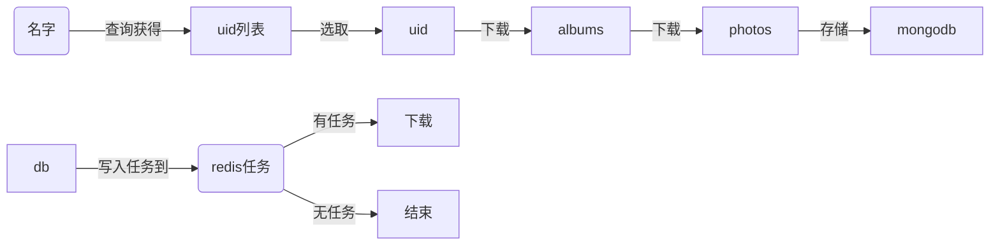

#微博爬虫

- [dk_swjtu](http://blog.csdn.net/dk_swjtu/article/details/50371738)
- [xchaoinfo](https://github.com/xchaoinfo/fuck-login/blob/master/007%20weibo.com/weibo.com.py)
- [cookie使用](http://blog.csdn.net/zhu_free/article/details/50563756)

## 分析

### 功能

- [x] 登陆


- [x] 查询名字 -> 获取 uid, 并由 uid -> 获取 albums入库
- [x] 获取指定 album 的 photos, 入库
- [ ] 读取入库数据, 产生 分布式 任务
- [ ] 分布式 消费下载任务
- [ ] 代理列表使用
- [x] items2下显示用户照片

### 使用

```sh
cmd = ./wb.py
# 查询名字对应的 uid

./wb.py -s 李三娘
# 列出所有备选项
 🍺   1. 1915268965      [霹雳无敌李三娘]
 🍺   2. 2019381770      [王晓凌1982]
 🍺   3. 1944234053      [李三娘凉凉千岁千岁千千岁]
 🍺   4. 2283017572      [李三孃_]
 🍺   5. 2655796844      [李三孃的查三哥]
# 输入备选 id, 开始下载该账号的 albums 到数据库中
[Depth: (1)]Your Choice(q-quit/b-back)?: 1
	<此处有照片展示>
	
    霹雳无敌李三娘
    1915268965
    http://tvax1.sinaimg.cn/crop.0.0.1242.1242.180/7228af65ly8fmc4jx2rwij20yi0yi419.jpg
    知名萌宠博主 萌宠视频自媒体
    简介：  天天被儿砸殴打的老母亲
    标签：天秤座  妖孽  酒鬼一枚

# 可以通过 y/n 来选择, 如果为y, 则拉取信息到本地, n 则返回上一级
Your Choice?[yn] (q-quit/b-back)?: y
 🍺 D 171214 17:30:50 wb:207 | Try Update (1915268965)
 🍺 D 171214 17:30:52 wb:213 | Success update all albums info

```


### 登陆

- `prelogin`

  > get 获取 login 所需要的参数

- `login`

  > 提交登陆信息

- `login跳转`

  > 提交登陆之后, 返回两部分结果

  - `setCrossDomainUrlList` 出现302 Moved Temporarily
  - `crossDomainAction` 解析到的 `url` 为需要的信息

- `crossDomainAction - url` 

  ```js
  {
  	"result": true,
  	"userinfo": {
  		"uniqueid": "1234567890",	// 即为用户的唯一编号
  		"userid": null,
  		"displayname": null,
  		"userdomain": "?wvr=5&lf=reg"
  	}
  }
  ```

- 存储 cookies, 下次使用 cookie, 避免重复登陆

  ```python
  def save_cookie(self):
      _cookie_jar = cookiejar.LWPCookieJar('cookie.txt')
      requests.utils.cookiejar_from_dict({
          c.name: c.value
          for c in self.sess.cookies
      }, _cookie_jar)
      _cookie_jar.save('cookie.txt', ignore_discard=True, ignore_expires=True)
  ```

  ​

### 照片获取

- 通过分析 [json](http://photo.weibo.com/photos/get_all) 返回数据来获取图片

  ```python
  url = 'http://photo.weibo.com/photos/get_all'
  params = {
    'uid': '1915268965',
    'album_id': '3558432200929057',
    'count': 100,
    'page': 1,
    'type': 3,
  }
  ```

  ​

- 解析入库

  ```python
  {
    'album_id': '',
    'total': 1000, # 返回的图片总数,
    'photo_list': []
  }
  ```

- 拼接参数

  ```python
  photo_id = '4180575598632596'
  url = 'http://wx1.sinaimg.cn/large/{}.jpg'.format(photo_id)
  # 下载
  ```

  ​


### 爬取流程



### 爬取实现 `分布式爬取`

